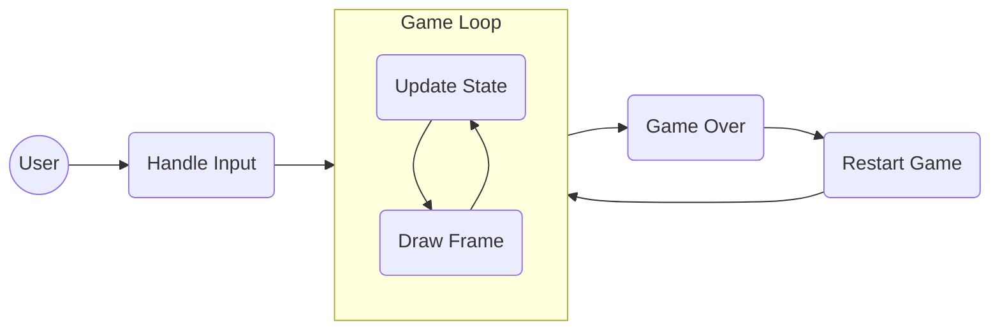

# Octy-Fly

[](https://developer.mozilla.org/en-US/docs/Web/HTML)
[](https://developer.mozilla.org/en-US/docs/Web/CSS)
[](https://developer.mozilla.org/en-US/docs/Web/JavaScript)

## Abstract

Octy-Fly is a browser-based Flappy Bird clone built using the HTML5 Canvas API and core web technologies (HTML, CSS, and JavaScript). The game challenges players to navigate an animated character through randomly generated obstacles while keeping a running score.

**_This repo was tested on modern web browsers including Google Chrome and Mozilla Firefox._**

----

## Features

- ***Classic Gameplay*** – A fully playable browser-based Flappy Bird clone.
- ***Canvas Rendering*** – Interactive rendering built with the HTML5 Canvas API.
- ***Dynamic Obstacles*** – Randomly generated pipes traversing the screen.
- ***Immersive Assets*** – Integrated sound effects and smooth GIF animations.
- ***Score Tracking*** – Real-time running score and game over mechanics.

----
## Flowchart



---
## Table of Contents

- [Requirements](#requirements)
   - [Hardware](#hardware)
   - [Software](#software)
- [Installation](#installation)
- [Project Structure](#project-structure)
- [Usage or Quick start](#usage-or-quick-start)
- [Credits](#credits)

---
## Requirements

### Hardware
- Any device capable of running a modern web browser.

### Software
- A modern web browser (Google Chrome, Mozilla Firefox, Safari, Microsoft Edge).

---
## Installation

**Clone the repository**

```bash
git clone <repository-url>
```

No additional dependencies are required. This project relies entirely on vanilla web technologies.

---
## Project Structure

```bash
octyfly
├── obstacles/             # Obstacle pipe images
├── sfx/                   # Game sound effects
├── Octopy.png             # Octopy logo
├── README.md              # Project documentation
├── bg.gif                 # Game background animation
├── explosion.gif          # Explosion animation
├── home_bg.gif            # Start screen background
├── index.html             # Main game file
├── sprite.gif             # Main character sprite
├── sprite2.gif            # Secondary character sprite
├── tbd.gif                # TBD animation
└── touch.gif              # Touch hint animation
```

---
## Usage or Quick start

To play the game, simply open the `index.html` file in your favorite web browser.

```bash
xdg-open index.html
```
Or double-click `index.html` in your file explorer.

Use the `Space` bar, `Up Arrow`, `X` key, or touch the screen to make the character fly and navigate through the pipes.

---
## Credits

+ **Author:** <span style="color:green">Kaléin Tamaríz</span>

+ **Based on project:** [Kenny Yip (Original Flappy Bird tutorial)](https://youtu.be/jj5ADM2uywg)

---
Return to [Table of Contents](#table-of-contents)
